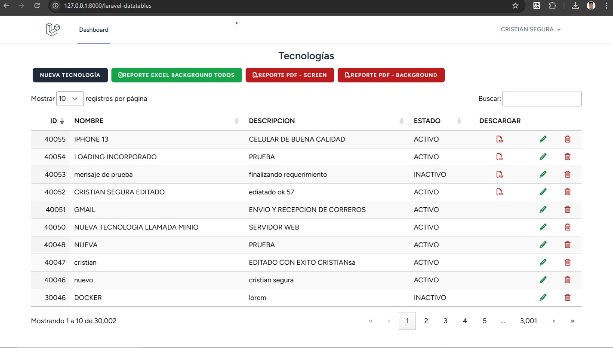

## Pasos para crear proyecto con docker

Este es un crud basico utilizando docker y sql server
El proyecto esta construido de la siguiente manera:

1. Autenticación de usuario segura vía Laravel/Breeze.
2. ⁠Presentación de un home con un menú básico.
3. ⁠Creación de un CRUD con todas sus características.
4. ⁠Generación de un reporte en excel con alrededor de 30.000 registros utilizando trabajos de segundo plano  (worker).
"Para los 30.000 registros se creo un seeder"
5. ⁠Generación de un reporte sencillo en PDF. "Utilizando DomPdf"
6. ⁠Manejo de peticiones seguras (form request). "Validacion de datos"

### 1 

```
Clonar repositorio.
crear carpeta data_sql_server en la misma linea de carpetas de dockerfiles, nginx etc
```

### 2
Crear imagenes de docker
```
docker-compose up -d
```

### 3 
Puede vaciar la carpeta .src y crear proyecto laravel este lo mapeara en .src
docker-compose run composer create-project laravel/laravel:^10.0 .

Si quiere continuar con este proyecto debe generar la key de laravel y instalar paquetes npm install
```
docker-compose run --rm artisan key:generate
```

- instalar vendor
- En el composer.json se agrego en "config":
- "process-timeout": 1200
- Esto para agregar tiempo en la descarga del vendor con docker local


```
docker-compose run --rm composer install
```

### 4 
En .env
```
DB_CONNECTION=sqlsrv
DB_HOST=host.docker.internal
DB_PORT=1433
DB_DATABASE=nombre_database
DB_USERNAME=sa
DB_PASSWORD='YourStrong#Password'
```

```
Correr Seeder
docker-compose run --rm artisan db:seed --class=TecnologiasSeeder

Correr migraciones
docker-compose run --rm artisan migrate
```

server: http://localhost:8080/
server MinIo: http://127.0.0.1:9001/login



### 5 

Para este proyecto se utiliza el servicio de [Pusher](https://pusher.com/) para enviar y recibir información en tiempo real con el fin de ver el porcentaje de generación de reporte.

